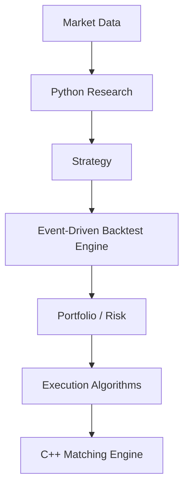

# Quant Trading System

## Goal

Build an interview-grade hybrid Python/C++ quantitative trading system spanning the full
research-to-execution path:

**Research → Backtesting → Portfolio/Risk → Execution → Matching Engine**

The repository establishes a strict market-data boundary. Python owns
research, analytics, strategy development, backtesting, and orchestration because its ecosystem
supports fast iteration. C++ owns latency-sensitive execution and order-book components,
where predictable performance and precise resource control matter.



The market-data entry point, return calculations, performance analytics, deterministic
event-driven backtester, three research strategies, position/P&L accounting, pre-trade exposure
controls, statistical risk analytics, leakage-resistant walk-forward research, and a deterministic
C++ matching engine, parent/child execution algorithms, execution-quality analytics, and an
independent European-options mathematics module, and reproducible performance-engineering harness
are implemented. The twelve-set roadmap is complete.

For a five-minute evaluator walkthrough, start with [docs/portfolio.md](docs/portfolio.md). The
requirement-by-requirement completion record is in
[docs/project-status.md](docs/project-status.md), with measured benchmark evidence in
[docs/performance.md](docs/performance.md).

## Architecture

External CSV columns are mapped once at the system boundary. All downstream code receives a
`pandas.DataFrame` with this ordered schema:

```text
timestamp, symbol, open, high, low, close, volume
```

`MarketDataLoader` handles file parsing, column resolution, type conversion, and chronological
sorting. `validate_ohlcv` separately enforces structural and financial invariants, making it
reusable by future database, streaming, or tick-data adapters. Bad data is rejected; prices and
volumes are never silently repaired.

The optional custom mapping is a mapping from source names to canonical names. If a file contains
both `Close` and `Adj Close`, `Close` wins. `Adj Close` is accepted only as a fallback when no
unadjusted close exists. Supplying a `symbol=` never silently overwrites a conflicting symbol in
the file.

See [docs/architecture.md](docs/architecture.md) for boundaries and extension points.

## Installation

Python 3.12+, a C++20 compiler, and CMake 3.20+ are required.

```bash
python3.12 -m venv .venv
source .venv/bin/activate
python -m pip install --upgrade pip
python -m pip install -e '.[dev]'
```

The editable install is the normal development setup. Pytest also knows about the checked-in
`python/` source tree, so no manual `PYTHONPATH` modification is needed.

## Loading market data

```python
from quant_system.data import MarketDataLoader

loader = MarketDataLoader()
data = loader.load_csv("data/sample/AAPL.csv", symbol="AAPL")
print(data.head())
```

For a vendor-specific file:

```python
data = loader.load_csv(
    "vendor_prices.csv",
    symbol="AAPL",
    column_mapping={
        "Trading Day": "timestamp",
        "First": "open",
        "Maximum": "high",
        "Minimum": "low",
        "Last": "close",
        "Shares": "volume",
    },
)
```

API clients remain responsible for transport and authentication, then hand decoded tabular data
to the same boundary. Both methods copy, normalize, sort, and validate without mutating provider
objects:

```python
data = loader.load_records(api_response["bars"], symbol="AAPL")
# Or, when an SDK already returns pandas:
data = loader.load_frame(provider_dataframe, symbol="AAPL")
```

## Returns and performance

Return transforms preserve the initial `NaN` created by the absence of a prior price. Metrics
accept that single leading `NaN`, but reject missing values elsewhere. Simple returns are
compounded rather than summed.

```python
from quant_system.quant import performance_report, simple_returns

returns = simple_returns(data["close"])
report = performance_report(returns, periods_per_year=252)
print(report.to_dict())
```

Conventions are explicit: volatility and Sharpe use sample standard deviation, the annual
risk-free rate is geometrically converted to the observation frequency, Sortino uses target
semideviation across all observations, and drawdowns are reported as non-positive numbers.

## Event-driven backtesting

Strategies see completed bars and emit signals without touching cash or positions. Signals become
fixed-size market orders, and the execution simulator permits them to fill only when a later bar
for that symbol arrives. The fill uses that next bar's open; the portfolio is marked independently
at the current close.

```python
from quant_system.backtest import BacktestEngine, SignalEvent, SignalSide
from quant_system.execution import PercentageCommission, PercentageSlippage
from quant_system.strategy import ScheduledSignalStrategy

strategy = ScheduledSignalStrategy(
    [
        SignalEvent(data.iloc[1]["timestamp"].to_pydatetime(), "AAPL", SignalSide.BUY),
        SignalEvent(data.iloc[4]["timestamp"].to_pydatetime(), "AAPL", SignalSide.EXIT),
    ]
)

engine = BacktestEngine(
    data=data.iloc[:6],
    strategy=strategy,
    initial_capital=100_000.0,
    quantity=100,
    commission=PercentageCommission(0.001),
    slippage=PercentageSlippage(0.0005),
)
result = engine.run()

print(result.final_equity)
print(result.performance)
print(result.pending_orders)
```

The scheduled strategy is an explicit pipeline-testing utility, not an investment strategy.
Unaffordable or risk-limit-violating orders are exposed in `result.rejected_orders`. Short sales
are disabled by default; use `allow_short_selling=True` explicitly. No margin or borrow model is
implied.

## Portfolio & P&L

Each symbol has one signed `Position`: positive quantity is LONG, negative is SHORT, and zero is
FLAT. Increasing exposure uses a quantity-weighted average entry price. Partial closes realize P&L
against the existing average without changing the remaining cost basis. Reversals first close the
old position, realize that P&L, and open the residual position at the reversal fill price.

`Portfolio` is authoritative for cash, positions, gross realized P&L, unrealized P&L, commission,
equity, and exposure. Gross realized trading P&L excludes commission; `net_realized_pnl` subtracts
cumulative commission. Slippage is already embedded in fill price and therefore appears through
cost basis and mark-to-market P&L without a second cash deduction.

```text
equity         = cash + sum(signed market values)
gross exposure = sum(abs(signed market values))
net exposure   = sum(signed market values)
```

Run the generated worked example:

```bash
python scripts/run_portfolio_example.py
```

Its actual output is:

```text
PORTFOLIO
Cash                 104,585.00
Equity               101,685.00
Gross Realized P&L       600.00
Unrealized P&L          1,100.00
Commission                 15.00

EXPOSURE
Gross Exposure         16,100.00
Net Exposure           -2,900.00
Gross Exposure %          15.83%
Net Exposure %            -2.85%

POSITIONS
AAPL     +60    Avg 100.00
MSFT     -50    Avg 200.00
```

The example begins with 100,000: `100,000 + 600 + 1,100 - 15 = 101,685`.

### Pre-trade risk

`RiskManager` evaluates the hypothetical final portfolio before an order reaches execution.
Available limits are absolute gross exposure, absolute net exposure, per-position notional, gross
exposure percentage, and position percentage. A violation produces a stable `RiskRejectReason`
and `RejectedOrder`; it is a normal backtest outcome, not an application exception. Orders that
reduce an existing violation are allowed, while reversals are assessed using their final signed
position.

## Implemented strategies

All strategies receive one completed `MarketEvent` at a time, maintain bounded per-symbol history,
and implement the same `Strategy` interface. They never receive the future DataFrame. Their target
state changes when a signal is emitted to prevent repeated orders; the portfolio remains the source
of truth for actual filled positions.

### Momentum

The research idea is that recent winners or losers may continue moving in the same direction.
`MomentumStrategy` calculates `current / lookback_price - 1` and accepts:

- `lookback`: number of periods in the comparison
- `threshold`: minimum absolute momentum required for entry or opposing exit

### Mean reversion

The research idea is that large deviations from a recent statistical mean may revert.
`MeanReversionStrategy` uses a rolling Z-score with population standard deviation and accepts:

- `window`: bounded rolling observation count
- `entry_z`: absolute Z-score required for entry
- `exit_z`: distance from zero at which an existing position exits

Constant windows have zero standard deviation and deliberately produce no signal.

### Moving-average crossover

The research idea is that changes in short-term trend relative to long-term trend may identify a
regime change. `MovingAverageCrossoverStrategy` accepts:

- `fast_window`
- `slow_window`, which must exceed `fast_window`
- `allow_short=False`, keeping the default mode long-only

It detects actual crossovers using both the previous and current fast-minus-slow difference; it
does not emit BUY repeatedly merely because the fast average remains above the slow average.

Run the cost-aware comparison example:

```bash
python scripts/run_strategy_backtest.py --strategy all --symbol AAPL
python scripts/run_strategy_backtest.py --strategy momentum --symbol AAPL
```

The report includes initial/ending equity, strategy and buy-and-hold returns, Set 2 metrics, fill
count, and round trips derived from completed or reversed positions. These elementary strategies
omit parameter optimization, capacity,
liquidity, borrow costs, and regime analysis. Backtest results are research observations, not
guarantees of future returns.

## Risk analytics

The statistical risk layer is separate from pre-trade limits: `RiskManager` decides whether an
order is permissible, while `risk.analytics`, `risk.var`, and `risk.report` describe observed
portfolio returns. Implemented measures include rolling annualized volatility, aligned Beta,
CAPM-style Alpha, historical and Gaussian VaR, Expected Shortfall, rolling Beta/Sharpe, and
peak/trough/recovery drawdown periods.

VaR and Expected Shortfall are reported as positive loss magnitudes: `0.025` means a 2.5% loss.
Volatility, covariance, and variance use sample statistics (`ddof=1`). Beta aligns asset and
benchmark by index. Alpha converts the effective annual risk-free rate to the observation
frequency and arithmetic-annualizes the fitted periodic intercept. Drawdown recovery occurs when
equity reaches or exceeds its previous peak; duration counts strictly underwater observations.

```python
from quant_system.risk import generate_risk_report

report = generate_risk_report(returns, equity, benchmark_returns=None)
print(report.to_text())
```

## Walk-forward research

Time-series research must preserve chronology: earlier rows train, later rows test, and data is
never shuffled. Each fold searches the parameter grid using only its train partition, freezes the
winning parameters, and then runs one out-of-sample backtest. Train bars can initialize indicator
history through a non-trading warm-up channel, but cannot create test-period signals, fills,
snapshots, returns, or P&L. Sequential test returns alone form the combined OOS equity curve.

```python
from quant_system.research import walk_forward_evaluate
from quant_system.strategy import MomentumStrategy

summary = walk_forward_evaluate(
    data,
    lambda **params: MomentumStrategy(**params),
    {"lookback": [5, 10, 20], "threshold": [0.01, 0.02]},
    train_size=15,
    test_size=5,
    objective="total_return",
)
print(summary.to_text())
```

Run the checked-in, cost-aware example:

```bash
python scripts/run_walk_forward.py
```

Its current sample result selects parameters independently in three folds and reports a combined
OOS return of `0.40%`, annualized volatility of `1.08%`, maximum drawdown of `-0.08%`, and three
fills. These are deterministic sample-data results, not an investment claim.

## C++ matching engine

The native engine stores prices as signed 64-bit integer ticks and quantities as unsigned integer
units. With a `0.01` tick, a price of `10025` represents `100.25`; floating-point values are never
used as book keys. Bids use a descending ordered map, asks use an ascending ordered map, and each
price level maintains a FIFO `std::list`.

`MatchingEngine` accepts structured submit, cancel, and modify commands. LIMIT remainders are
GTC-like and rest subject to price protection. MARKET orders are IOC-like: they walk all available
opposite-side liquidity and any unfilled remainder is cancelled, never rested. Trades always use
the resting order's price.

```cpp
quant_engine::MatchingEngine engine;

engine.submit({1, quant_engine::Side::Sell, quant_engine::OrderType::Limit, 30, 100});
engine.submit({2, quant_engine::Side::Sell, quant_engine::OrderType::Limit, 40, 100});
engine.submit({3, quant_engine::Side::Sell, quant_engine::OrderType::Limit, 50, 101});

auto result = engine.submit(
    {10, quant_engine::Side::Buy, quant_engine::OrderType::Market, 100, std::nullopt}
);
// Trades: 30 @ 100, 40 @ 100, 30 @ 101.
```

The active-order hash map uniquely owns mutable orders. Price levels hold non-owning pointers in
stable FIFO list nodes and local ID-to-iterator indexes. Completed/cancelled orders move to history,
so dead orders never remain active while final state remains queryable. No pervasive shared
ownership is used.

Cancel/replace priority rules are explicit:

- Same-price total-quantity decrease keeps sequence and FIFO priority.
- Quantity increase loses priority and receives a new sequence.
- Any price change loses priority, receives a new sequence, and is matched again before resting.
- A new total quantity cannot be below the already executed quantity.
- Reducing total quantity to exactly executed quantity cancels the remainder.

```text
             SUBMIT
                |
              NEW
             /   \
        REJECT   ACTIVE
                  |
          +-------+--------+
          |       |        |
       PARTIAL  FILLED   CANCELLED
          |
       +--+---------+
       |            |
     FILLED      CANCELLED
```

Structured results expose stable rejection codes, generated trades, and execution reports with
executed/remaining quantity, quantity-weighted average price, and last-fill details. Self-trade
prevention and full IOC/FOK/DAY/GTC policy support are intentionally deferred because participant
identity and advanced time-in-force semantics are not modeled yet.

| Operation | Complexity target |
| --- | --- |
| Active order lookup | O(1) average |
| Add to existing level | O(1) FIFO insertion |
| Add new price level | O(log P) |
| Best bid / ask | O(1) |
| Same-price quantity decrease | O(1) |
| Quantity increase | O(1) queue relocation |
| Price change | O(log P) plus matching consumed |
| Cancel known order | O(1), plus O(log P) if its level becomes empty |
| Match | O(orders and price levels consumed) |

`P` is the number of active price levels. These are data-structure bounds, not latency or
throughput claims.

## Execution algorithms

The execution layer sits above `MatchingEngine`. A strategy decides **what** position it wants,
an execution algorithm decides **how** to divide that parent order, and the matching engine
determines what actually fills against available liquidity.

```text
Parent Order
     |
     +---- TWAP
     +---- VWAP
     +---- POV
     |
ExecutionScheduler
     |
Child Orders
     |
MatchingEngine -> Trades -> ExecutionSummary
```

Parent orders track requested, actually executed, and remaining integer quantities plus a
`Pending → Active → PartiallyFilled → Filled/Cancelled/Expired` lifecycle. Each child stores its
parent ID, scheduled simulated time, and schedule sequence. Trades map back to the originating
child, preserving `Trade → Child → Parent` traceability.

### TWAP

TWAP distributes quantity approximately evenly across deterministic interval starts. Five slices
over `[10:00, 10:10)` occur at `10:00, 10:02, 10:04, 10:06, 10:08`. Integer remainders go to the
earliest slices, so 1,003 units become `201, 201, 201, 200, 200`. If slices exceed quantity, empty
children are omitted.

### VWAP

VWAP allocates against a validated, normalized expected-volume profile. Integer conversion uses
largest-remainder allocation: floor every weighted target, then award remaining units by descending
fractional remainder with original bucket order as the tie-breaker. This guarantees exact total
quantity deterministically. Schedule generation is O(B log B) for B buckets.

### POV

POV reacts dynamically to observed market volume. Each event targets
`floor(participation_rate × observed_volume)`, capped by the parent's actual remaining quantity.
Zero-volume or sub-unit targets emit no child. Work outside matching is O(1) per observation.

The scheduler advances a simulated clock without threads or sleeping. Static TWAP/VWAP children
are submitted in `(scheduled_time, schedule_sequence, order_id)` order. MARKET children are used
because Set 9 deliberately has no arbitrary limit-price policy. Unfilled child quantity returns to
the parent; the default final static slice attempts the entire actual remaining quantity. A parent
still incomplete at its horizon becomes `Expired`.

Crucially, parent execution is updated from child fills—not submitted quantity. Execution summaries
contain child/fill counts, quantity-weighted average price, first/last fill time, status, and POV
realized participation when observed volume exists.

Run the fair deterministic comparison (each algorithm receives the same 1,000 units of liquidity
at 100 ticks):

```bash
./build/execution_example
```

The current result is 1,000/1,000 filled, four children, four fills, and average price `100.0000`
for each TWAP, VWAP, and POV run. This compares mechanics under one controlled scenario and makes
no claim that one algorithm is universally superior.

## Execution analytics

Execution analytics consumes `ExecutionSummary` and explicit benchmark data after matching; it
does not alter order-book behavior. Arrival price is captured when the parent starts rather than
reconstructed from fills. Market VWAP uses an external market tape, never our own fills. All
directional costs use one sign convention: positive means unfavorable for both BUY and SELL.

```text
BUY slippage  = execution price - benchmark price
SELL slippage = benchmark price - execution price
slippage bps  = slippage / benchmark price × 10,000
```

Implementation shortfall is `execution cost + fees + opportunity cost`. Execution cost applies
arrival-price movement only to filled quantity; opportunity cost applies arrival-to-final movement
to unfilled quantity. Decision-to-arrival delay cost is exposed separately and is not added again
to total shortfall. Spread cost is explicitly an estimate against the arrival midpoint.

Run the common TWAP/VWAP/POV scenario with calculated quality reports:

```bash
./build/execution_example
```

## Derivatives

The separate `quant_engine::derivatives` module prices European calls and puts under
Black–Scholes with continuous dividend yield, computes Delta/Gamma/Vega/Theta/Rho, and recovers
implied volatility. Expiry and zero-volatility limits are handled explicitly, and option prices
are checked against dividend-adjusted European arbitrage bounds before root finding.

Newton–Raphson is the primary IV solver. It falls back to bracketed bisection when Vega is too
small, an update leaves configured bounds, or Newton does not converge. Analytical Delta, Gamma,
and Vega are independently checked against central finite differences.

```bash
./build/options_example
```

### Financial conventions

- Execution-engine prices are integer ticks; analytics converts costs using explicit `tick_value`.
- Option inputs and outputs use `double`; rates are continuously compounded annual decimals.
- Volatility is an annual decimal and time to expiry is measured in years.
- Execution slippage is positive when unfavorable for either side.
- VaR/Expected Shortfall remain positive loss magnitudes; drawdowns remain non-positive.
- Theta is annual. Vega is per absolute `1.0` volatility change; divide by 100 for one vol point.
- Rho is per absolute `1.0` rate change; divide by 100 for one percentage point.

## Performance

The C++ engine includes a deterministic Release benchmark harness for submit, cancel, modify,
crossing/market matching, mixed traffic, and price-level scaling. Workloads support 10K, 100K,
and 1M operations with separate bulk-throughput and per-command-latency modes. Reports include
median throughput across runs, nearest-rank p50/p95/p99/max latency, trades/fills, book depth,
seed, compiler/build metadata, invariant status, and a deterministic final-state checksum.

On the documented Apple M4 Release environment, the reserved-capacity mixed 1M workload measured
1,074,053 operations/s with p50 833 ns, p95 1,666 ns, and p99 1,750 ns. These are machine-specific
measurements, not production or HFT claims. See [docs/performance.md](docs/performance.md) for the
methodology, complete tables, profile evidence, baseline/optimized comparison, limitations, and
reproduction commands.

```bash
cmake -S cpp -B build-release -DCMAKE_BUILD_TYPE=Release
cmake --build build-release
./build-release/benchmarks/quant_engine_benchmarks \
  --benchmark mixed --operations 1000000 --seed 42 --runs 5
```

## Development commands

Run Python quality checks from the repository root:

```bash
pytest
ruff check .
mypy python/quant_system
```

Configure, compile, and test the C++ foundation:

```bash
cmake -S cpp -B build
cmake --build build
ctest --test-dir build --output-on-failure
```

Optional AddressSanitizer and UndefinedBehaviorSanitizer validation:

```bash
cmake -S cpp -B build-sanitize -DENABLE_SANITIZERS=ON -DCMAKE_BUILD_TYPE=Debug
cmake --build build-sanitize
ctest --test-dir build-sanitize --output-on-failure
```

## Repository structure

```text
.
├── .github/workflows/ci.yml       # Python and C++ CI
├── benchmark_results/             # Reproducible baseline/optimized CSV output
├── cpp/
│   ├── benchmarks/                # Deterministic throughput/latency harness
│   ├── include/quant_engine/      # Matching, execution, analytics, derivatives APIs
│   ├── src/                       # Native implementations by responsibility
│   ├── tests/                     # Deterministic CTest suites
│   ├── examples/                  # Execution-quality and options runners
│   └── CMakeLists.txt
├── data/
│   ├── raw/                       # Local immutable inputs (ignored)
│   ├── processed/                 # Generated data (ignored)
│   └── sample/AAPL.csv            # Deterministic example fixture
├── docs/
│   ├── architecture.md            # Component boundaries and data flows
│   ├── performance.md             # Benchmark method, evidence, and results
│   ├── portfolio.md               # Five-minute evaluator overview
│   └── project-status.md          # Roadmap requirement traceability
├── python/
│   ├── quant_system/
│   │   ├── data/                  # Set 1 loader, model, schema, validation
│   │   ├── quant/                 # Returns and performance analytics
│   │   ├── backtest/              # Events, orders, engine, and results
│   │   ├── strategy/              # Momentum, Z-score, and MA strategies
│   │   ├── portfolio/             # Position, P&L, cash, exposure, snapshots
│   │   ├── risk/                  # Limits plus statistical risk analytics/reports
│   │   ├── research/              # Chronological splits and walk-forward evaluation
│   │   └── execution/             # Simulator, commission, and slippage
│   └── tests/                     # Unit and end-to-end tests by component
├── scripts/                       # Strategy, portfolio, and walk-forward examples
└── pyproject.toml
```

## Current implementation status

- Canonical immutable `OHLCVBar` model and shared schema constants
- CSV, DataFrame, and decoded API-record loading through one validation pipeline
- Strict timestamp, numeric, finite-value, duplicate, OHLC, and volume validation
- Deterministic sample data and comprehensive pytest coverage
- Simple/log returns, compounding, equity curves, and strict input validation
- CAGR, volatility, Sharpe, Sortino, drawdown, and typed performance reports
- Typed FIFO event pipeline with strategy, risk, execution, and portfolio boundaries
- Next-bar-open market execution with pending/rejected-order audit trails
- Fixed and percentage commission/slippage models
- Average-price long/short accounting, reversals, realized/unrealized P&L, and exposure
- Pre-trade absolute and percentage exposure limits with explicit rejection records
- Immutable portfolio snapshots integrated with Set 2 performance metrics
- Incremental per-symbol momentum, Z-score mean-reversion, and MA crossover strategies
- Cost-aware strategy comparison and buy-and-hold research benchmark
- Rolling volatility, Beta, Alpha, VaR/ES, rolling risk, and drawdown-period analytics
- Consolidated benchmark-optional risk reports with positive-loss VaR conventions
- Rolling/expanding chronological splits and deterministic parameter grids
- Training-only selection, frozen test parameters, safe warm-up, and combined OOS reporting
- C++20 price-time-priority limit and IOC-like market matching
- Cancel/replace priority rules, lifecycle history, reports, and rejection codes
- Deterministic 10,000-submit invariant stress coverage and optional ASan/UBSan
- Parent/child execution state with simulated-clock scheduling and traceability
- Deterministic TWAP, largest-remainder VWAP, and observed-volume POV
- Actual-fill accounting, final-slice catch-up, expiry, and execution summaries
- Direction-aware slippage, market VWAP, spread/delay/opportunity costs, and shortfall reports
- Black–Scholes calls/puts with dividend yield, parity, edge cases, and analytical Greeks
- Bounded Newton–Raphson implied volatility with robust bisection fallback
- Deterministic Release benchmark harness with throughput and tail-latency distributions
- 10K/100K/1M scaling, depth tests, checksums, CSV output, and optional regression thresholds
- Profile-driven opt-in capacity reservation with measured baseline/optimized reports
- Ruff, mypy, pytest, CMake, and GitHub Actions configuration

## Roadmap status

Sets 1–12 are complete. Possible future extensions include Python/C++ bindings, richer
time-in-force and self-trade controls, margin/borrow models, American/exotic options, volatility
surfaces, and more sophisticated market-impact attribution. These are intentionally outside the
completed roadmap rather than partially implemented production claims.
