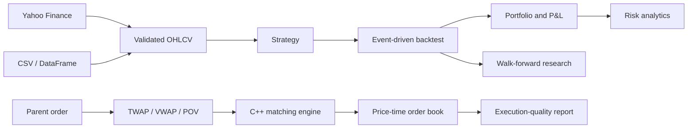
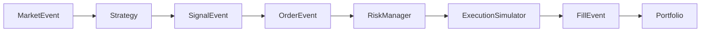

# Quant Execution Lab

Quant Execution Lab is a hybrid Python/C++ trading research and execution simulator. It models
the path from market data and strategy research to portfolio accounting, risk measurement, order
scheduling, and exchange-style matching.

```text
market data → strategy → backtest → portfolio/risk → execution → matching
```

The project is designed as an engineering laboratory, not a live trading application. It provides
deterministic workflows for studying how trading ideas behave, how costs affect results, how risk
changes after fills, and how execution algorithms interact with an order book.

## What the project demonstrates

The repository is divided by runtime responsibility:

- **Python** handles data ingestion, strategy logic, event-driven backtesting, transaction-cost
  simulation, portfolio accounting, statistical risk, and walk-forward research.
- **C++** handles the latency-sensitive order model, limit-order book, matching engine, parent-order
  execution algorithms, execution-quality analytics, options mathematics, and benchmarks.
- **The dashboard** provides one visual workspace for validated market data, backtests, research,
  market-driven portfolio valuation, and native execution simulation.

The Python and C++ systems are deliberately independent. The dashboard can run both, but a Python
strategy does not currently send its orders directly into the C++ matching engine. A future binding
can connect that boundary without coupling pandas or research state to native order-book internals.

## End-to-end workflow



### 1. Market data

The dashboard downloads daily price history from Yahoo Finance using a ticker, exchange, and
period. It supports global symbols plus Indian NSE and BSE instruments. Choose the exchange and
enter the plain Indian symbol (`RELIANCE`, `TCS`, or `AXISBANK`), or enter a complete Yahoo symbol
such as `RELIANCE.NS` or `RELIANCE.BO`. Built-in aliases cover `NIFTY50`, `BANKNIFTY`, and `SENSEX`.
Any NSE/BSE security or index available through Yahoo Finance can be requested with its Yahoo
ticker; exchange availability and history length remain provider-dependent.
CSV upload and repository-local CSV paths remain available for offline or private datasets.

The India sector map compares ten transparent, equal-weight baskets covering banking and finance,
IT, energy, automobiles, pharmaceuticals, consumer staples, metals, real estate, industrials, and
telecom. Each basket uses three named large NSE companies and reports both basket return and member
breadth. This avoids presenting incomplete free-provider sector-index history as authoritative.

Every source crosses the same validation boundary and becomes this canonical schema:

```text
timestamp, symbol, open, high, low, close, volume
```

The loader normalizes names and types, sorts chronologically, and rejects invalid financial data.
It does not silently repair missing prices, impossible OHLC relationships, negative volume, or
duplicate observations.

### 2. Strategy research

Three interchangeable example strategies are included:

| Strategy | Decision rule |
|---|---|
| Momentum | Enters when lookback return crosses a positive or negative threshold |
| Mean reversion | Trades deviations from a rolling mean using a Z-score |
| Moving-average crossover | Trades sign changes between fast and slow moving averages |

Strategies receive completed market events one at a time. They cannot modify cash, positions, or
orders directly. Their only output is a typed signal.

### 3. Event-driven backtesting

The backtester uses an explicit event pipeline:



The ordering prevents same-bar look-ahead:

1. Previously submitted orders may fill only on a later bar for the same symbol.
2. The fill uses that later bar's open.
3. Commission and adverse slippage are applied.
4. Accepted fills update cash and positions.
5. The portfolio is marked using the current close.
6. The strategy receives the completed bar and may create a new signal.

Results include the equity curve, total return, CAGR, annualized volatility, Sharpe ratio, Sortino
ratio, maximum drawdown, fills, rejected orders, and pending final-bar orders.

### 4. Portfolio and risk

The portfolio owns cash, signed positions, average entry price, realized and unrealized P&L,
commission, equity, and gross/net exposure.

```text
equity         = cash + signed market value
gross exposure = sum(abs(position market value))
net exposure   = sum(position market value)
```

Position accounting supports increases, partial closes, full closes, shorts, and reversals. The
pre-trade risk manager evaluates the hypothetical final portfolio before an order reaches the
execution simulator. It can constrain position notional, gross exposure, net exposure, leverage,
and per-position exposure while still allowing risk-reducing orders.

Statistical risk reporting includes:

- annualized volatility;
- Beta and Alpha when a benchmark is supplied;
- historical and parametric Value at Risk;
- Expected Shortfall;
- maximum drawdown and underwater duration; and
- current exposure and leverage when a portfolio is supplied.

### 5. Walk-forward validation

Walk-forward research tests whether parameters selected on past data survive unseen data:

```text
train → score parameter grid → freeze winner → test out of sample → roll forward
```

Training history may warm up a strategy, but it cannot create test-window trades or P&L. Only
out-of-sample returns are combined into the final equity and risk report. This makes the process
more realistic than selecting parameters and reporting performance on the same observations.

### 6. C++ matching and execution

The native engine implements:

- strongly typed limit and market orders;
- ordered bid and ask price levels;
- deterministic price-time priority;
- crossing limit orders and multi-level market-order walks;
- cancel, quantity reduction, priority-losing size increases, and price changes;
- parent orders and child-order scheduling;
- TWAP, VWAP, and POV execution algorithms; and
- fill-rate, VWAP, slippage, arrival-cost, and implementation-shortfall analytics.

The C++ module also includes European Black-Scholes call/put pricing, analytical Greeks, and a
hybrid Newton/bisection implied-volatility solver.

## Dashboard

The dashboard is one scrollable Risk Management System (RMS) and decision workspace with a compact
header instead of a sidebar:

1. **Risk monitor** — configure account capital, position quantity, concentration, leverage,
   drawdown, and one-day VaR limits. The RMS derives marked equity, daily P&L, gross unrealized P&L,
   commission-aware net P&L, gross
   exposure, leverage, 95% historical VaR, limit utilization, breaches, alerts, and a position table
   from the selected instrument's real history.
2. **Market analysis** — inspect price and volume, understand the period move, and locate the latest
   close inside its high-low range.
3. **India sector map** — compare Nifty 50, Sensex, and Bank Nifty alongside ten NSE sector baskets,
   constituent returns, market breadth, provider coverage, and 1M/3M/6M/1Y views.
4. **Strategy lab** — understand when each model is useful, compare it with buy-and-hold, and read a
   plain-language verdict covering excess return, Sharpe ratio, drawdown, and sample size. A separate
   walk-forward verdict reports how many unseen windows were positive.
5. **Execution and portfolio** — follow a three-step parent-order workflow, compare TWAP, VWAP, and
   POV through graphical fill summaries, and receive an interpretation of differences or identical
   outcomes. Real symbol/price inputs are labelled separately from simulated liquidity and fills.
   Portfolio output explains P&L and concentration before linking back to the RMS.

The dashboard is served by a validated FastAPI application on Uvicorn. Request schemas reject
unexpected fields and invalid ranges, Yahoo responses pass through the canonical data validator,
and the bounded market-data cache expires entries after 60 seconds. The application runs only
allowlisted workflows and never exposes an arbitrary command shell through the browser.

## Quick start

Requires Python 3.12+.

```bash
python3.12 -m venv .venv
source .venv/bin/activate
python -m pip install --upgrade pip
python -m pip install -e '.[dev]'
quant-dashboard
```

Open [http://127.0.0.1:8000](http://127.0.0.1:8000).

Yahoo Finance is the default source and does not require an API key. Internet access is required
when fetching a symbol for the first time. Recent results are cached briefly in the dashboard
process for 60 seconds to limit repeated downloads. Pressing **Load data** explicitly bypasses that
cache and takes a fresh Yahoo snapshot; dependent RMS, portfolio, backtest, and execution calls then
share the same snapshot so their calculations reconcile. Indian instruments are displayed and backtested in INR;
global instruments default to USD.

Interactive API documentation is available at
[http://127.0.0.1:8000/api/docs](http://127.0.0.1:8000/api/docs). The server binds to localhost by
default. If you bind to `0.0.0.0`, place it behind authentication and a trusted reverse proxy;
the project does not include public-user authentication.

### CSV format

CSV files must contain the canonical fields, although common capitalization is normalized:

```csv
timestamp,symbol,open,high,low,close,volume
2026-01-02,AAPL,100.0,102.0,99.0,101.0,1000000
```

The included example is `data/sample/AAPL.csv`.

## Build the C++ engine

Requires CMake 3.20+ and a C++20 compiler.

```bash
cmake -S cpp -B build-release -DCMAKE_BUILD_TYPE=Release
cmake --build build-release
ctest --test-dir build-release --output-on-failure
```

The Python dashboard works without a C++ build, but the **Execution algorithms** action requires
`build-release/execution_example` or `build/execution_example`.

Run the native examples directly:

```bash
./build-release/execution_example \
  --symbol RELIANCE.NS \
  --quantity 1000 \
  --price-ticks 140025
./build-release/options_example
```

## Command-line research workflows

The dashboard is optional. The same Python features can be exercised from the command line:

```bash
# Compare all included strategies on the sample data
python scripts/run_strategy_backtest.py

# Evaluate a deterministic momentum parameter grid out of sample
python scripts/run_walk_forward.py

# Demonstrate long/short position and P&L accounting
python scripts/run_portfolio_example.py
```

Examples accept `--data` and `--symbol`; the strategy comparison also accepts
`--strategy momentum`, `--strategy mean-reversion`, or `--strategy ma-crossover`.

## Testing and code quality

```bash
# Python behavior
pytest

# Python linting and strict type checking
ruff check .
mypy python/quant_system

# Native behavior
ctest --test-dir build-release --output-on-failure
```

The suite covers market-data failures, calculations, strategy state, event ordering, execution
timing, cash and position accounting, risk decisions, walk-forward isolation, order-book
invariants, matching, execution algorithms, derivatives, and benchmark infrastructure.

For sanitizer validation:

```bash
cmake -S cpp -B build-sanitize \
  -DCMAKE_BUILD_TYPE=Debug \
  -DENABLE_SANITIZERS=ON
cmake --build build-sanitize
ctest --test-dir build-sanitize --output-on-failure
```

## Performance engineering

The benchmark harness generates deterministic submit, cancel, modify, crossing, market-order,
level-walk, depth, and mixed workloads. It reports throughput plus p50, p95, and p99 latency.

```bash
./build-release/benchmarks/quant_engine_benchmarks \
  --benchmark mixed \
  --operations 1000000 \
  --seed 42 \
  --runs 5 \
  --reserve
```

The recorded Apple M4 Release-build baseline reached approximately 1.07 million operations per
second on the deterministic one-million-operation mixed workload. This is reproducible local
evidence, not an exchange-latency or universal hardware claim. See
[docs/performance.md](docs/performance.md) for methodology, percentiles, checksums, and limitations.

## Repository structure

```text
quant-execution-lab/
├── python/quant_system/
│   ├── backtest/          Event queue, engine, orders, reports
│   ├── data/              Ingestion, canonical schema, validation
│   ├── execution/         Python commission, slippage, fill simulation
│   ├── portfolio/         Positions, cash, P&L, exposure
│   ├── quant/             Returns and performance metrics
│   ├── research/          Parameter search and walk-forward evaluation
│   ├── risk/              Limits, VaR, Expected Shortfall, reports
│   ├── strategy/          Momentum, mean reversion, MA crossover
│   ├── web/               Dashboard HTML, CSS, and JavaScript
│   └── dashboard.py       Local dashboard server and API
├── python/tests/          Python test suite
├── cpp/
│   ├── include/           Public C++ headers
│   ├── src/               Matching, execution, analytics, derivatives
│   ├── tests/             Native correctness tests
│   ├── benchmarks/        Deterministic workload harness
│   └── examples/          Execution and options examples
├── data/sample/           Small checked-in OHLCV dataset
├── benchmark_results/     Recorded benchmark evidence
├── docs/                  Architecture, performance, and portfolio notes
└── scripts/               Runnable Python examples
```

## Design principles

- **Deterministic before realistic:** identical inputs produce identical event traces and results.
- **No hidden data repair:** invalid data fails at the ingestion boundary.
- **No look-ahead:** signals cannot fill on the bar that produced them.
- **Explicit costs:** commission and adverse slippage are visible configuration.
- **Clear ownership:** strategies decide, risk approves, execution fills, and portfolios account.
- **Measured performance:** optimization follows baseline, profile, change, re-measure, and verify.
- **Narrow language boundary:** Python and C++ remain independently testable.

## Current limitations

This repository is a simulator and educational engineering project. It currently does not provide:

- broker connectivity or live order submission;
- live streaming or tick-level market data;
- a Python-to-C++ production binding;
- margin, borrow availability, financing, dividends, or corporate-action accounting;
- portfolio optimization or multi-currency accounting;
- exchange networking, persistence, concurrency, or recovery; or
- trading recommendations or investment advice.

Yahoo Finance data is intended for research use. Verify licensing, adjustment conventions, and
data quality before using any external dataset in a decision-making process.

## Further documentation

- [Architecture and invariants](docs/architecture.md)
- [Performance methodology and results](docs/performance.md)
- [Portfolio walkthrough](docs/portfolio.md)
- [Implementation status](docs/project-status.md)
