# Architecture

## System overview

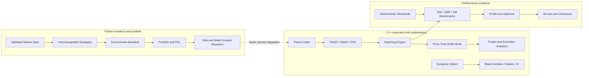

The dashed boundary is deliberate: the Python research stack and C++ execution engine build and
test independently. A future binding can connect typed parent orders without coupling pandas,
strategy state, or portfolio internals to native book containers.

## Design principles

The repository separates research-oriented Python from latency-sensitive C++. The split is based
on runtime concerns, not duplicated business concepts: Python orchestrates experiments and
simulation, while C++ exposes narrowly defined execution primitives.

The market-data layer is the first stable boundary. Vendor-specific names and textual values are
allowed only before normalization. CSV files, decoded API records, and provider DataFrames all
enter the same normalization and validation path. Downstream components can depend on the
canonical ordered schema `timestamp, symbol, open, high, low, close, volume` and on its validation
guarantees.

## Market-data flow

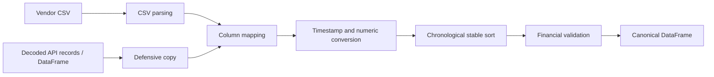

Responsibilities are intentionally narrow:

- `models.py` defines the value model and canonical names.
- `loader.py` owns CSV parsing plus DataFrame/record adapters and column mapping.
- `validation.py` validates any already-normalized DataFrame without mutating it.
- `exceptions.py` gives callers a stable, catchable error hierarchy.

Rows are sorted globally by timestamp and then symbol. Duplicate timestamps are defined per
symbol, so two different instruments may have a bar at the same instant. This representation can
therefore support both single-instrument files and future multi-instrument/minute data.

## Failure policy

Corrupt financial data is rejected at ingestion. The loader may normalize representation—column
names, data types, row order, and whitespace around symbols—but does not infer missing prices,
clip volume, alter OHLC values, or deduplicate observations. Exceptions include the affected
symbol, timestamp, field, value, or source row whenever that context is available.

## Dependency direction

Future Python packages may import `quant_system.data`; the data package must not import strategy,
backtest, portfolio, risk, or execution code. The C++ target currently has no Python dependency.
Future bindings should sit at the execution boundary rather than leaking C++ details into research
modules.

The `quant_system.quant` package consumes ordinary numeric series and remains independent of CSV
parsing. `returns.py` owns return and compounding transformations. `metrics.py` owns scalar
statistics, drawdown analysis, and report aggregation. This keeps future backtests free to reuse
the same analytics without coupling them to the market-data loader.

## Event-driven backtesting

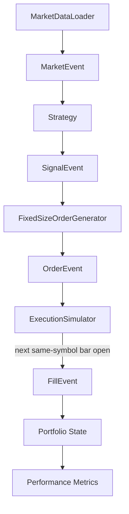

The loop processes each bar in a deliberate order:

1. Previously pending orders become eligible only if the current event is for the same symbol and
   has a strictly later timestamp. Eligible fills use the current open.
2. Accepted fills update cash and positions. Unaffordable fills become rejected orders.
3. The portfolio records mark-to-market equity using current/latest close prices.
4. Only then does the strategy receive the completed market event and emit signals.
5. Signals become orders and remain pending until a later eligible event.

This order makes a same-bar fill impossible even if a caller submits a signal at the bar timestamp:
the execution simulator independently enforces `market.timestamp > order.timestamp`. An order on
the final bar therefore remains in the result's pending-order collection.

Responsibilities remain separate:

- Strategies decide and may keep strategy-specific state; they cannot execute or change portfolios.
- The fixed-size order generator translates BUY/SELL/EXIT intent using a read-only position value.
- The simulator owns next-bar timing, adverse price impact, commission calculation, pending FIFO
  state, and duplicate-order rejection; it never changes portfolio state.
- The portfolio applies fills, owns cash/positions/P&L/exposure, and marks equity; it never decides.
- The engine injects dependencies and orchestrates these components through an in-process queue.
- Set 2 functions calculate result metrics; formulas are not duplicated in the engine.

`FillEvent.slippage` is total monetary execution impact relative to the next open. The adverse fill
price already contains that impact, so portfolio cash flows deduct notional at the fill price plus
commission and do not deduct slippage again. Short sales require the explicit
`allow_short_selling=True` engine setting; no full margin model exists yet.

## Strategy layer

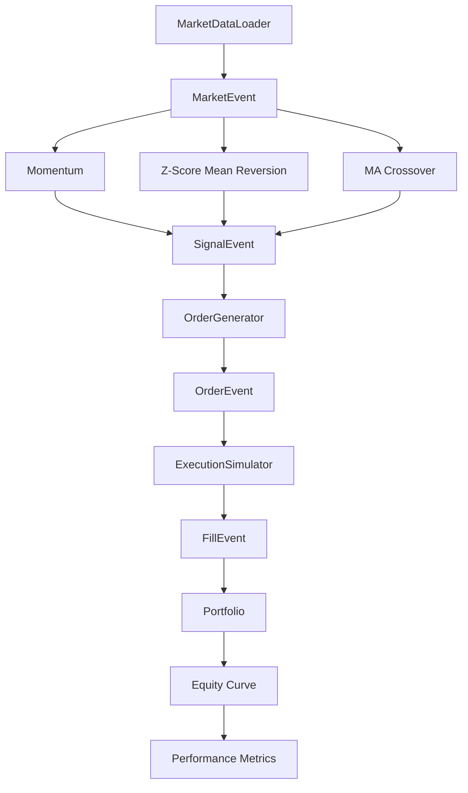

Each strategy sees only the current completed event and bounded history accumulated from prior
events. No strategy receives a DataFrame, uses negative shifts, or precomputes future information.
Histories, intended position states, and diagnostics are keyed by symbol, preventing one asset from
changing another asset's decisions.

- Momentum retains `lookback + 1` closes and compares the current close with the oldest retained
  close. An opposing threshold exits the intended LONG or SHORT state.
- Mean reversion retains `window` closes and uses population standard deviation. It enters at
  symmetric Z-score extremes, exits toward zero, and skips zero-variance windows.
- Moving-average crossover retains `slow_window` closes plus the prior fast-minus-slow difference.
  Only a sign crossover emits a signal. It is long-only unless short entries are explicitly enabled.

Strategy state represents intended exposure and changes when the strategy emits a signal; it is not
portfolio accounting. Actual exposure changes only through fills in `Portfolio`. This separation
is why the engine contains no strategy names or strategy-specific branches.

`backtest.report` runs any mapping of strategy names to interface implementations through identical
engine and transaction-cost configuration. It uses existing result performance values and adds a
single-symbol close-to-close buy-and-hold benchmark. It does not declare a winner. Round trips now
come from authoritative position close/reversal transitions.

## Portfolio and pre-trade risk

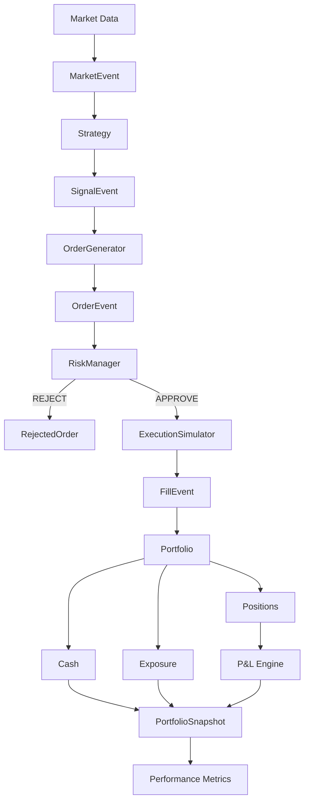

`Position` uses a signed integer quantity and one average entry price. Same-direction fills update
the weighted average. Opposing fills realize gross trading P&L on the closed quantity; partial
closes preserve the old average, flat positions reset it to zero, and reversals open the residual
at the reversal price. Commission is portfolio-level and separate from position realized P&L.

`Portfolio` is the only component allowed to process fills. It updates cash, delegates cost-basis
accounting to the symbol position, accumulates commission, and marks open positions using the latest
known close. Every market event yields an immutable snapshot containing cash, equity, gross
realized P&L, unrealized P&L, and gross/net exposure.

`RiskManager` receives an order, current portfolio, and decision-time market price. It constructs
the final hypothetical signed position and evaluates absolute position, gross exposure, absolute
net exposure, and percentage limits. A limit rejects only when the hypothetical value exceeds the
limit and increases the corresponding current exposure. This permits risk-reducing orders while a
portfolio is already in violation and correctly handles reversals that cross through zero. Normal
rejections return stable reason codes and never mutate or reach the simulator.

## Statistical risk analytics

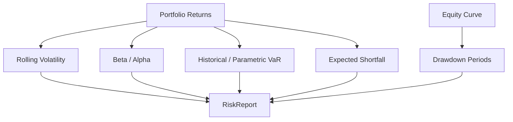

Statistical analytics consume realized return/equity series and never participate in order
approval. Sample standard deviation is used for volatility and covariance-based measures. Asset
and benchmark observations are joined by index before Beta or Alpha is calculated. VaR and
Expected Shortfall use a positive-loss convention, while drawdown remains non-positive. A
drawdown recovers at `equity >= prior peak`; its duration is the number of strictly underwater
observations and excludes the recovery bar.

## Walk-forward research

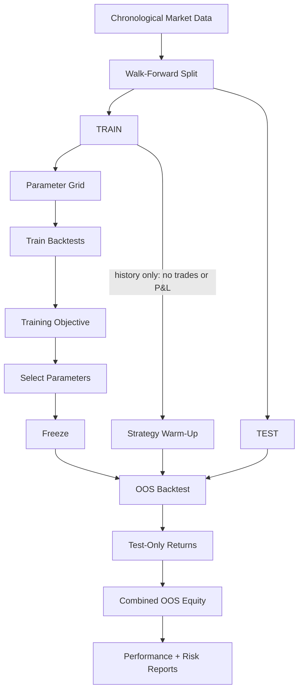

`research.split` implements chronological holdout, rolling windows, and expanding windows without
randomization. `research.walk_forward` evaluates a generic strategy factory and deterministic
parameter grid. The objective sees training `BacktestResult` objects only. The selected mapping is
copied and used to construct a fresh test strategy; no test statistic can revise it.

Indicator warm-up is explicit. The test engine resets the strategy, calls `warm_up` with only
strictly earlier training bars, and then begins its normal event loop at the official test start.
Warm-up bypasses the event queue, execution, portfolio, and snapshots, so it can supply historical
context without contaminating OOS trades or returns. Overlapping test folds are rejected when
combining OOS results, preventing the same period from being counted twice.

## C++ matching engine

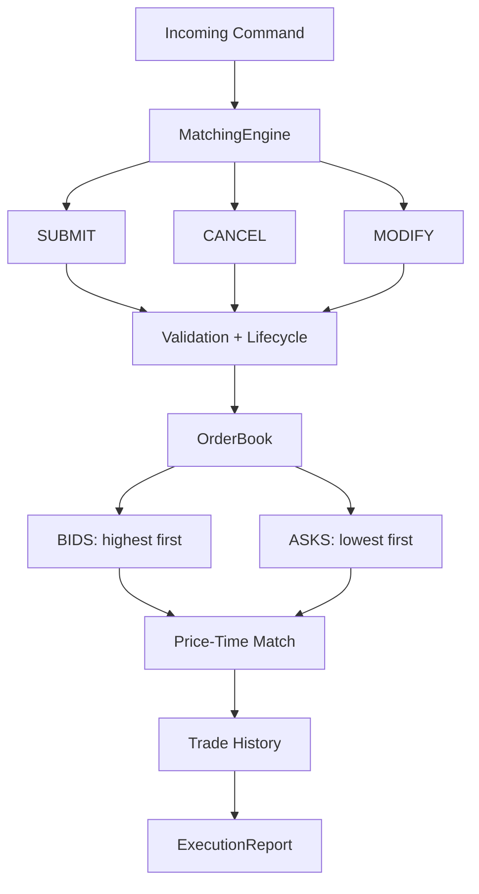

The Python and C++ layers remain independently buildable; bindings are future work. Inside the
native engine, `MatchingEngine` validates command semantics and produces structured results, while
`OrderBook` owns price-level selection, FIFO matching, active/history transitions, and trades.

Prices are `std::int64_t` ticks and quantities are `std::uint64_t`. Bid and ask levels are ordered
maps, giving best-price access at the first node and O(log P) level insertion/removal. Each
`PriceLevel` uses a FIFO list plus an ID-to-list-iterator hash index. The top-level active hash map
uniquely owns `Order` objects and stores stable price-level addresses; levels contain non-owning
pointers. Removal from the FIFO always precedes moving an order to history, avoiding dangling
references.

LIMIT orders match only eligible prices and rest any remainder. MARKET orders ignore price bounds,
walk available liquidity, and cancel an unavailable remainder. Both consume best price first,
then oldest sequence, and execute at the resting price. The resting book cannot remain crossed.

Replacement validation occurs before mutation. A same-price quantity decrease updates the level
total in place and preserves sequence. Quantity increases and all price changes remove the old
queue entry, assign a new monotonic sequence, re-run matching, and rest only an unmatched limit
remainder. Invalid changes leave the original order untouched.

| Operation | Intended complexity |
| --- | --- |
| Active order lookup | O(1) average |
| Existing-level insertion | O(1) |
| New-level insertion | O(log P) |
| Best bid / ask | O(1) |
| Same-price decrease | O(1) |
| Quantity increase | O(1) queue relocation |
| Price change | O(log P) plus matching |
| Known-order cancel | O(1), plus O(log P) if level erased |
| Matching | O(orders/levels consumed) |

An optional invariant scan verifies level totals, active-index membership, live status, positive
remaining quantity, side/type consistency, non-empty levels, and an uncrossed resting book. The
10,000-submit deterministic correctness test invokes it throughout the command stream.

## Execution-algorithm layer

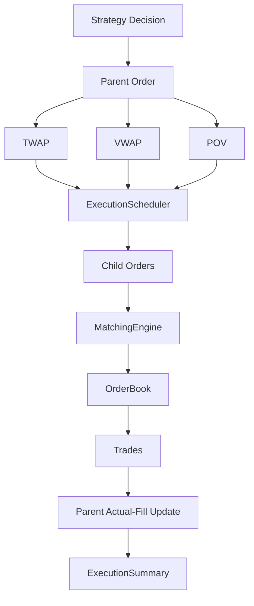

Algorithms do not receive mutable matching-engine access. TWAP and VWAP are stateless schedule
generators over a read-only parent and compact context. POV is intentionally dynamic: one observed
market-volume event may produce one capped child. `ExecutionScheduler` owns parent state, simulated
time, schedules, child results, fill timestamps, and trade-to-child traceability; `MatchingEngine`
continues to own exchange state independently.

TWAP uses evenly spaced interval starts and distributes division remainders to earliest slices in
O(S). VWAP validates chronological non-overlapping buckets, normalizes positive weights, and uses
largest-remainder allocation in O(B log B). POV calculates one floored, remaining-capped target in
O(1) per volume event. All matching cost remains proportional to book liquidity consumed.

Only actual `ExecutionReport.executed_quantity` advances a parent. A partially filled or unfilled
MARKET child therefore returns its unavailable quantity to the parent. By default, the last static
schedule opportunity submits the parent's full actual remainder; disabling catch-up leaves the
planned slice unchanged and any residual expires at the execution boundary. POV never generates
after fill/cancel/expiry and records observed market volume separately from our executed volume.

Static children use MARKET orders because no limit-price policy is defined in Set 9. The scheduler
orders equal timestamps by explicit schedule sequence, with order ID as a final deterministic
tie-breaker, and uses no wall-clock sleeping or background threads.

## Execution analytics

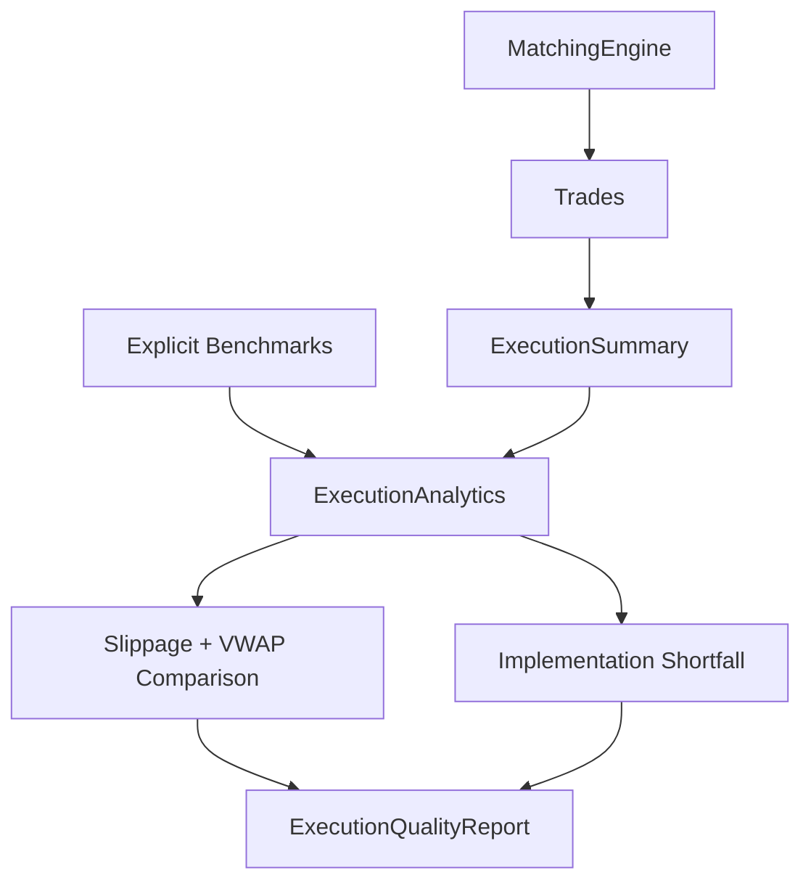

Analytics is downstream and read-only. The matching engine remains unaware of arrival price,
market VWAP, fees, or execution-quality judgments. Benchmarks are explicit inputs: arrival price
is captured at parent activation, the market tape is distinct from our fills, and final price is
required for partial-fill opportunity cost. Missing inputs produce absent optional metrics rather
than invented values.

Direction-normalized slippage is positive when execution is unfavorable. Total implementation
shortfall is filled-quantity execution cost relative to arrival, plus fees, plus unfilled-quantity
opportunity cost relative to the final market price. Decision-to-arrival delay is separately
reported so the total cannot double-count pre-arrival movement.

## Derivatives mathematics

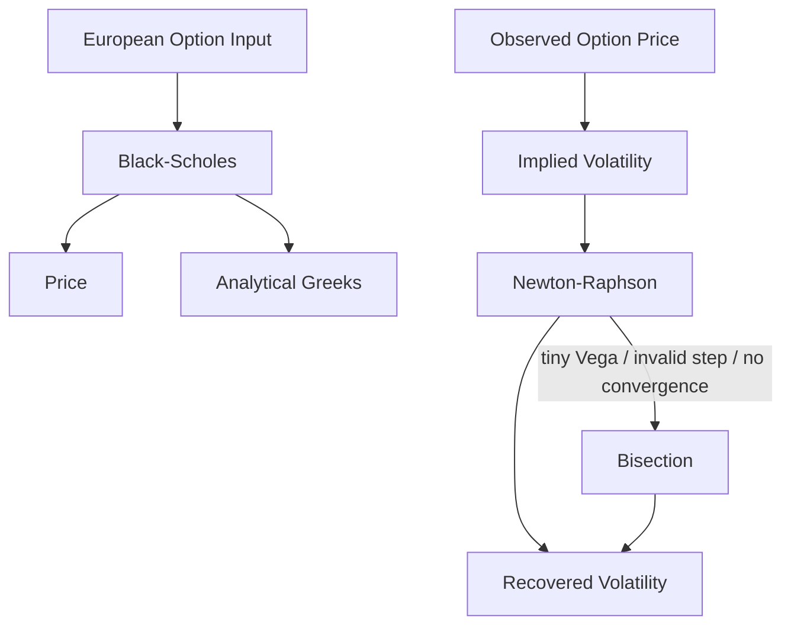

The derivatives namespace has no order-book or execution dependency. Black–Scholes supports
continuous dividend yield, negative finite rates, intrinsic value at expiry, and the deterministic
discounted-payoff limit at zero volatility. Greeks use closed-form formulas; Vega and Rho are per
absolute unit changes and Theta is annual.

Implied volatility first checks dividend-adjusted European arbitrage bounds. Newton–Raphson uses
analytical Vega within explicit iteration and volatility bounds. Tiny Vega, a non-finite or
out-of-bounds step, or exhausted Newton iterations transfers control to bracketed bisection. An
unbracketed price or exhausted solver fails explicitly instead of returning a misleading value.

## Performance engineering

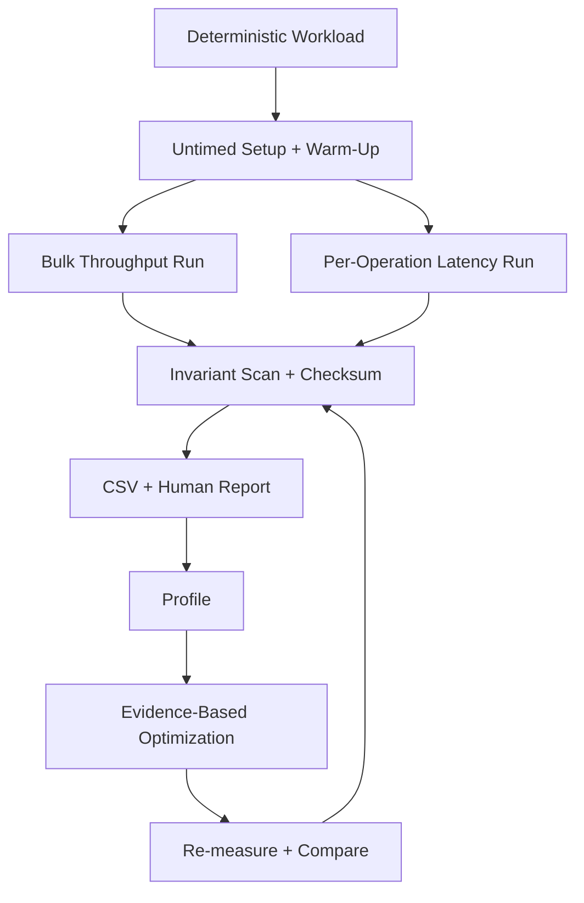

Benchmark code is linked as a separate support library and executable; it does not enter matching
hot paths. Workloads are generated before timing from explicit seed/configuration. The runner uses
fresh engine state per measured run, reports median throughput, records latency in an independent
run, and rejects nondeterministic checksums, trade counts, or invariant failures.

The first profile identified allocation/rehash work in active and per-level hash indexes. The only
retained optimization is an explicit capacity hint used by known-size replays. It reserves hashes
and trade history without changing order ownership or matching semantics. Default engine behavior
is unchanged, and the hint's memory-for-rehash tradeoff remains visible to callers. Detailed
methodology and actual results are in `docs/performance.md`.

## Deferred components

Factor models beyond market Beta, tax lots, FX, corporate actions, margin interest, borrow costs,
advanced optimization, Python/C++ bindings, self-trade prevention, advanced time-in-force,
adaptive execution policies, American/exotic options, volatility surfaces, richer market-impact
attribution, cross-language integration, and production-level profiling belong to later sets.
